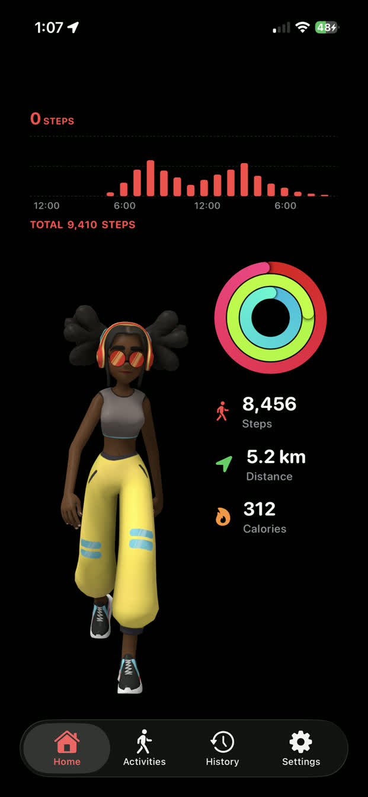
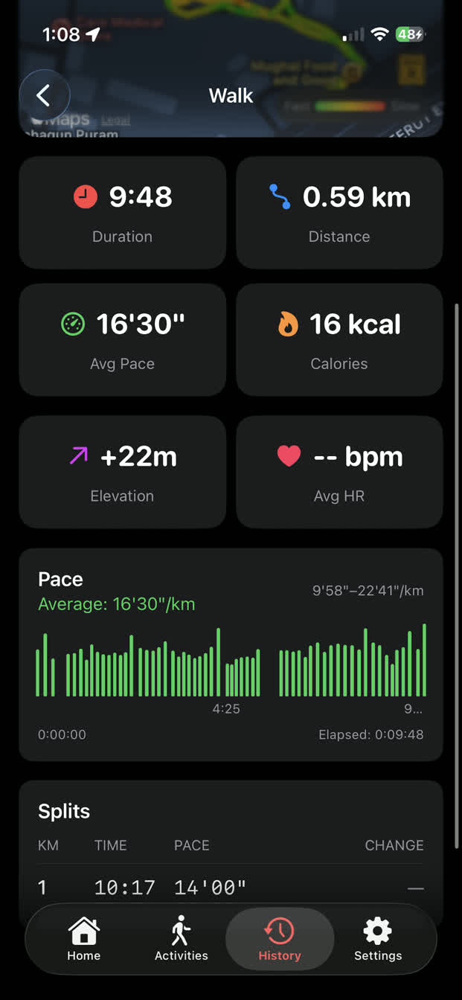
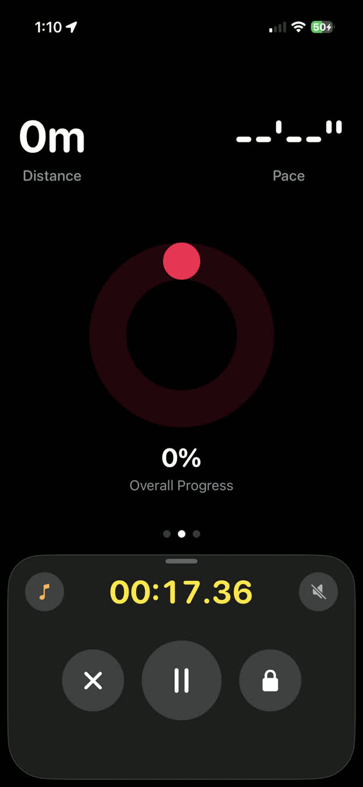
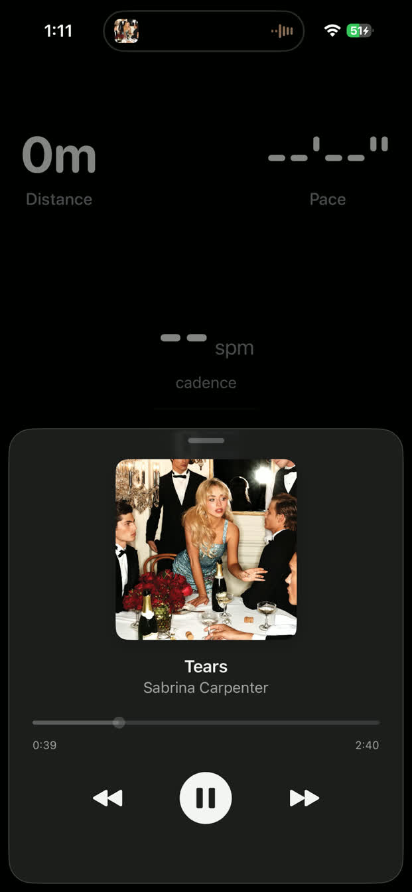
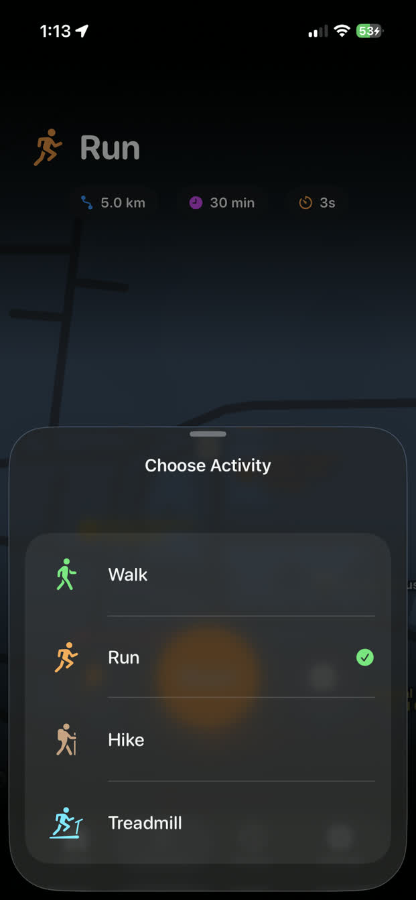

<div align="center">

#  
# Pace

### *Your Personal Running & Walking Companion*

[](https://swift.org)
[](https://developer.apple.com/ios/)
[](https://developer.apple.com/xcode/swiftui/)
[](https://developer.apple.com/healthkit/)
[](LICENSE)

<br/>

> **Track every step. Crush every goal. Look amazing doing it.** 🔥

<br/>





</div>

---

## ✨ Features That Slap

<table>
<tr>
<td width="50%">

### 📊 Real-Time Tracking
- 🏃 Live distance, pace & calories
- 💓 Heart rate monitoring (Apple Watch)
- 👟 Cadence tracking
- 🗺️ GPS route with pace colors

</td>
<td width="50%">

### 🎯 Goal Crusher Mode
- 📏 Distance goals (1K to Marathon)
- ⏱️ Time-based targets
- 🔊 Voice announcements every KM
- 🎉 Goal completion celebrations

</td>
</tr>
<tr>
<td width="50%">

### 🗺️ Workout History
- 📈 Beautiful pace charts
- 🌈 Color-coded route maps
- ⚡ Kilometer splits
- 📊 Detailed statistics

</td>
<td width="50%">

### 🎵 Music Integration
- 🎧 Control music mid-workout
- 🍎 Apple Music support
- 🟢 Spotify compatible
- 🔇 Mute announcements anytime

</td>
</tr>
</table>

---

## 📱 Screenshots

<div align="center">

| Live Session | Home | History |  Session |
|:---:|:---:|:---:|:---:|
|  |  |  |  |

| Music Control | Activites | Activity View |
|:---:|:---:|:---:|
|  |  |  |

</div>

---

## 🎬 Demo

<div align="center">

https://github.com/Kartikayy007/Pace/raw/main/Doc/ScreenRecording_12-25-2025%2002-59-31_1_compressed.mp4

*Watch Pace in action! 🏃‍♂️*

</div>

---

## 🛠️ Tech Stack

<div align="center">

| Technology | Purpose |
|:---:|:---:|
|  | Core Language |
|  | UI Framework |
|  | Health Data |
|  | Maps & Routes |
|  | GPS Tracking |
|  | Voice Announcements |
|  | 3D Character |

</div>

---

## 🚀 Getting Started

### Prerequisites

- Xcode 15.0+
- iOS 17.0+
- Physical iPhone (GPS & HealthKit require real device)

### Installation

```bash
# Clone the repo
git clone https://github.com/Kartikayy007/Pace.git

# Open in Xcode
cd Pace
open Pace.xcodeproj

# Build & Run on your iPhone
# (Simulator won't work for GPS tracking)
```

---

## 🏗️ Architecture

```
Pace/
├── 📱 View/           # SwiftUI Views
│   ├── Home/          # Dashboard & Activity Ring
│   ├── Activities/    # Workout Sessions
│   ├── History/       # Past Workouts
│   └── Settings/      # User Preferences
├── 🧠 ViewModels/     # Business Logic
├── 📦 Models/         # Data Structures
├── ⚙️ Services/       # Core Services
│   ├── WorkoutService
│   ├── PedometerService
│   ├── AnnouncementService
│   └── MusicService
└── 🎨 Components/     # Reusable UI
```

---

## 🤝 Contributing

Contributions are what make the open source community amazing! Any contributions you make are **greatly appreciated**.

1. Fork the Project
2. Create your Feature Branch (`git checkout -b feature/AmazingFeature`)
3. Commit your Changes (`git commit -m 'Add some AmazingFeature'`)
4. Push to the Branch (`git push origin feature/AmazingFeature`)
5. Open a Pull Request

---

## 📄 License

Distributed under the MIT License. See `LICENSE` for more information.

---

## 💖 Acknowledgments

- Inspired by Nike Run Club & Apple Fitness
- 3D Character animations via SceneKit
- Built with ❤️ and way too much ☕

---

<div align="center">

### ⭐ Star this repo if you found it useful!

**Made with 💪 by [Kartikay](https://github.com/Kartikayy007)**

<br/>

[](https://github.com/Kartikayy007)
[](https://x.com/_kartikayy__)

</div>
